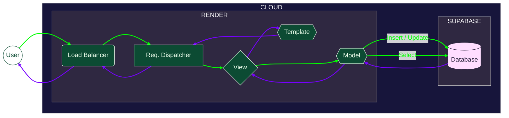
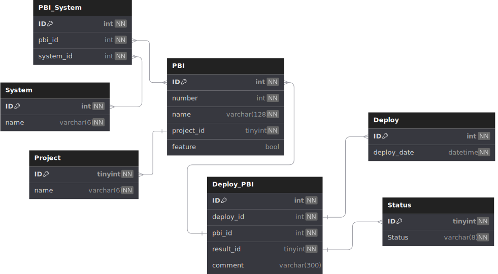

<h1 align="center">
  <br>
  VMAP
</h1>


Trabalhando nas atualizações semanais dos sistemas, quatro indivíduos perceberam a necessidade de possuir um registro eficiente para documentar as deploys e as tarefas de cada deploy, tanto o que é aprovado quanto o que, por algum problema, volta para desenvolvimento. Após a ideia do internamente eleito PO do projeto Daniel, nasceu o VMAP.

Criado em Django como Framework MVC, o VMAP (Visualization and Mapping Platform) é uma plataforma de visualização e mapeamento de tarefas que seguem a esteira de implantação até o ambiente de Produção e tem como principal objetivo armazenar de forma organizada e estruturada as tarefas deploy por deploy, registrando os sistemas e projetos de impactos de cada tarefa, juntamente com o resultado de cada tarefa.

Ainda que um projeto experimental no momento, possui boas perspectivas acadêmico-profissionais, porquanto é perfeitamente capaz de servir como material prático de estudo e solução para um problema: o histórico preciso de tarefas atualizadas.

Cada diferente seção do projeto está organizada de forma bem específica em seu diretório, utilizando do conceito de modularidade. Esta estrutura facilita a localização dos elementos com base eu sua funcionalidade, objetivo ou finalidade. Detalhes sobre a estrutura de diretórios a seguir:

```bash
.
├── .github                               # Diretório de arquivos de repositório
│   ├── README.md                         # Arquivo exibido na raíz do repositório
│   └── workflows                         # Sub-diretório de pipelines de manutenção
│
├── build.sh                              # Script de deploy via Render
│
├── docker                                # Diretório de arquivos Docker
│   ├── docker-compose-dev.yml            # Orquestrador para desenvolvimento
│   ├── docker-compose-unittest.yml       # Orquestrador para testes
│   ├── docker-compose.yml                # Orquestrador em caráter de produção
│   └── Dockerfile                        # Criador da imagem do projeto
│
├── docs                                  # Diretório de arquivos de documentação
│   ├── db                                # Documentação referente ao Banco de Dados
│   ├── logo.svg                          # Logo do projeto
│   └── web                               # Documentação referente à arquitetura do projeto
│
├── LICENSE                               # Arquivo de licença
│
├── loadtests                             # Diretório de testes de carga
│   ├── load_test.py                      # Script para teste de carga do tipo Load
│   ├── soak_test.py                      # Script para teste de carga do tipo Soak
│   ├── spike_test.py                     # Script para teste de carga do tipo Spike
│   ├── stress_test.py                    # Script para teste de carga do tipo Stress
│   └── utils.py                          # Script utilitário para os testes de carga
│
├── report                                # Diretório de relatórios autogerados
│   ├── csv                               # Sub-diretório de relatórios CSV
│   └── html                              # Sub-diretório de relatórios HTML
│
├── requirements.dev.txt                  # Arquivo de dependências de desenvolvimento
│
└── VMAP                                  # Diretório do projeto Django
    ├── CORE                              # App de configurações
    ├── manage.py                         # Script de operações administrativas
    ├── requirements.txt                  # Arquivo de dependências de produção
    └── ...                               # Apps de produção

```

## Stack


## Arquitetura

A arquitetura pode ser detalhada de forma geral em dois níveis: web e database. As mecânicas são abstraídas a um nível geral, evitando detalhes profundos que confundam à agregar, apresentando uma visão comportamental em escala "macro" seguindo o fluxo de dados sem focar no "micro", como cada ação de cada função. Acompanhe abaixo o fluxo de informações na Web, seguido da estruturação e arquitetura o Banco de Dados:

### VMAP



### DB



**OBS: para mais detalhes sobre o Banco de Dados acesse [Detalhes do Banco de Dados](https://dbdocs.io/lucasgoncsilva04/VMAP)**

## Requisitos

Para cada seção do projeto, definidas por diretórios, há uma atribuição única onde para cada atribuição, requisitos próprios são necessários para a utilização. Acompanhe abaixo os requisitos para utilização de cada módulo do VMAP - valendo lembrar que é recomendado instalar as dependências diretas do projeto dentro de um ambiente virtual:

- `VMAP/` - por razões óbvias, possuir [Python](https://www.python.org/) com Pip e rodar `pip install -r requirements.txt`
- `docker/` - possuir as engines do [Docker](https://www.docker.com/) e [Docker Compose](https://docs.docker.com/compose/) para criação e inicialização dos containers com as imagens do projeto
- `docs/` - possuir [NodeJS](https://nodejs.org/en/), [NPM](https://www.npmjs.com/) ou equivalente e instalar [DBDocs](https://dbdocs.io/docs)
- `loadtests/` - possuir [Python](https://www.python.org/) e rodar `pip install -r requirements.dev.txt` para instalar [Locust](https://locust.io/)

## Desenvolvendo

Antes de iniciar com o desenvolvimento e os comandos, é importante definir as variáveis de ambiente no seu ambiente de desenvolvimento. Abaixo a listagem de quais definir:

| Variável                 | Caráter                | Responsabilidade                                                                     |
| :----------------------- | :--------------------- | :----------------------------------------------------------------------------------- |
| `DJANGO_SETTINGS_MODULE` | `str - optional`       | Definir o módulo de configurações a ser utilizado.<br>`Default: "CORE.settings.dev"` |
| `DATABASE_NAME`          | `str - optional`       | Definir o nome de acesso do Banco de Dados.<br>`Default: "postgres"`                 |
| `DATABASE_USER`          | `str - optional`       | Definir o usuário de acesso do Banco de Dados.<br>`Default: "postgres"`              |
| `DATABASE_PASSWORD`      | `str - optional`       | Definir a senha de acesso do Banco de Dados.<br>`Default: "postgres"`                |
| `DATABASE_HOST`          | `str - optional`       | Definir o host de acesso do Banco de Dados.<br>`Default: "localhost"`                |
| `DEBUG`                  | `bool - optional`      | Definir traceback e informações de debug em páginas browser.<br>`Default: True`      |
| `SECRET_KEY`             | `str - optional`       | Definir chave de criptografia e segurança do projeto.<br>`Default: "cw%t5...ba^m3)"` |
| `ALLOWED_HOSTS`          | `list[str] - optional` | Definir lista de endereços URL válidos para execução do projeto.<br>`Default: ['*']` |

### VMAP - `/VMAP`

#### Realizar Migrações (Atualizações) de Banco de Dados

```bash
python manage.py makemigrations
```

#### Atualizar Estrutura do Banco de Dados com Novas Migrações

```bash
python manage.py migrate
```

#### Coletar Arquivos Estáticos

```bash
python manage.py collectstatic --no-input
```

#### Iniciar Testes Automatizados

```bash
python manage.py test
```

#### Formatar Arquivos e Diretórios

```bash
ruff check --select I --fix
ruff format
```

#### Iniciar o Servidor de Desenvolvimento

```bash
python manage.py runserver
```

#### Iniciar o Servidor de Performance de Produção

```bash
gunicorn CORE.wsgi:application --bind 0.0.0.0:8000
```

#### Criar Superusuário

```bash
python manage.py createsuperuser
```

### Docker - `/docker`

#### Criar Container Orquestrado

```bash
docker compose up --build  #  para "docker-compose.yml"
```
ou

```bash
docker compose -f docker-compose-[dev/unittest] up --build  #  para "docker-compose-dev.yml" ou "docker-compose-unittest.yml"
```

### Loadtests - `/loadtests` - Aplicação Rodando (local ou via docker)

#### Rodar Teste "Stress"

```bash
locust --headless -f loadtests/stress_test.py \
-H http://localhost:8000 --processes -1 \
--csv report/csv/load/stress --html report/html/stress.html
```

#### Rodar Teste "Load"

```bash
locust --headless -f loadtests/load_test.py \
-H http://localhost:8000 --processes -1 \
--csv report/csv/load/load --html report/html/load.html
```

#### Rodar Teste "Soak"

```bash
locust --headless -f loadtests/soak_test.py \
-H http://localhost:8000 --processes -1 \
--csv report/csv/load/soak --html report/html/soak.html
```

#### Rodar Teste "Spike"

```bash
locust --headless -f loadtests/spike_test.py \
-H http://localhost:8000 --processes -1 \
--csv report/csv/load/spike --html report/html/spike.html
```

### Docs - `/docs`

#### Gerar Documentação do DB

```bash
dbdocs login
dbdocs build docs/arch/db.dbml
```

## Licença

This project is under [MPLv2 - Mozilla Public License Version 2.0](https://choosealicense.com/licenses/mpl-2.0/). Permissions of this weak copyleft license are conditioned on making available source code of licensed files and modifications of those files under the same license (or in certain cases, one of the GNU licenses). Copyright and license notices must be preserved. Contributors provide an express grant of patent rights. However, a larger work using the licensed work may be distributed under different terms and without source code for files added in the larger work.

## Autores

<table>
  <tr>
    <td align="center">
      <a href="https://github.com/LucasGoncSilva" title="GitHub">
        
        <br>
        <b>Daniboy</b>
      </a>
      <br>
      <sub><a href="https://www.linkedin.com/in/luksgonc/" title="LinkedIn">LinkedIn</a></sub>
    </td>
    <td style="width: 70ch;">Se ser o cara que decide for um crime, prenda-o por tal delito. O menino Daniel é o eleito líder, PO, quem decide o que ninguém consegue. Um n*gão de tirar o chapéu.</td>
    <td align="center">
      <a href="https://github.com/andersonjader0" title="GitHub">
        
        <br>
        <b>Show</b>
      </a>
      <br>
      <sub><a href="https://www.linkedin.com/in/anderson-j-710685235/" title="LinkedIn">LinkedIn</a></sub>
    </td>
    <td style="width: 70ch;">O mano do Front-End, apesar de estar se aventurando no outro lado da força. O mais experiente em desenvolvimento de interfaces responsivas e piadas ruins.</td>
  </tr>
  <tr>
    <td align="center">
      <a href="https://github.com/Vinefonseca" title="GitHub">
        
        <br>
        <b>Vine</b>
      </a>
      <br>
      <sub><a href="https://www.linkedin.com/in/vin%C3%ADcius-fonseca-barbosa-230147245/" title="LinkedIn">LinkedIn</a></sub>
    </td>
    <td style="width: 70ch;">A.K.A Vicinius, foi o arquiteto do Banco de Dados, autor da logo e maior opinador crítico, também o maior motivador da equipe (quando ele mesmo motivado).</td>
    <td align="center">
      <a href="https://github.com/LucasGoncSilva" title="GitHub">
        
        <br>
        <b>Goncas</b>
      </a>
      <br>
      <sub><a href="https://www.linkedin.com/in/luksgonc/" title="LinkedIn">LinkedIn</a></sub>
    </td>
    <td style="width: 70ch;">Responsável pela maior parte das tarefas administrativas, é como o faxineiro-secretário, contribuiu com a estrutura do projeto e o Back-end da plataforma.</td>
  </tr>
</table>
